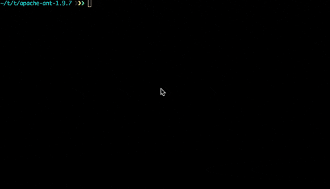

*Note: This is a post from an older blog that I have copied over. I haven't reviewed these instructions in some time.*

### Overview
Investigating problems with Java based products often involves reaching into the code to get a firm idea of the 
application logic that is introducing an error or abhorrent behaviour. When the source code is not readily available, 
but you have the application at hand it makes sense to inspect the code. Decompilers attempt to reverse engineer 
bytecode within a Java Class file and produce an intelligible Java file that can be used for inspection.

This document uses: CFR as the decompiler. Although any compiler that will take a class file as input and print to 
standard output will work for this configuration.

### Video (gif) Example


Before you continue, please check that the decompiler works in the following fashion:
`java -jar <decompiler-jar> /path/to/a/class/file` returns a decompiled class file onto the command line within your 
environment.

Vim treats JAR (Java Archive) files as Zip files. To that extent, when an attempt to open a JAR file occurs through Vim,
it will simply open and show the contents of the zip. When a *.class file is opened, it will typically just produce the 
contents of that file (bytecode). Vim report the path to this class file in the format 
`zipfile:<path-to-jar>::<path-to-class-in-jar>`.

We need to be able to handle *.class files both within a JAR file and simply residing on the file system. When vim 
encounters these we want to therefore trigger a script that will handle these two situations. This can be added to your
`.vimrc` file.

```shell
 au BufRead *.class call SetClassOptions()
 function SetClassOptions()
      silent %!/<your-path-to>/scripts/get-class-from-jar.sh %
      set readonly
      set ft=java
      silent normal gg=G
      set nomodified
 endfunction
```
So, just what does the SetClassOptions() Function do: 
1. Run the script and take the vim file path as input into this
command. 
2. Set the file to read-only. 
3. Set the file type to Java (for syntax highlighting)
4. Indent the file correctly (might not be needed depending on decompiler) 
4. Pretend the file has not been modified

### The Script that makes magic happen

The script below will pull out a Class file from a JAR based on the path format ViM reports as mentioned earlier.

```shell
 #!/bin/sh

 pathToDecompiler=/path/to/decompiler/cfr_0_115.jar

 fileType=$(echo $* | cut -f1 -d:)
 jarFile=$(echo $* | cut -f2 -d:)
 classFile=$(echo $* | cut -f4 -d:)
 uuid=$(uuidgen)
 
 
 if [ $fileType = "zipfile" ]
 then
      tmpDir=/tmp/$uuid
      unzip -qq $jarFile $classFile -d $tmpDir
      java -jar $pathToDecompiler $tmpDir/$classFile
      rm -rf /tmp/$uuid/ >&/dev/null
 else
      java -jar $pathToDecompiler $*
 fi
```

This script simply: 
1. Splits out the file path 
2. Creates a tmp directory 
3. Extracts the Class file to this directory 
4. Decompiles the Class 1. Deletes the tmp directory.

It also handles the ordinary situation of a class file being opened. Note: I left /tmp/ in the rm command as a 
safety in the event the argument is not correctly defined.

### Summary
If you want to handle decompilation of Class files directly from ViM follow the above steps. This provides a great way 
to avoid breaking your workflow within vim.

